# DEPLOYING APPLICATIONS INTO KUBERNETES CLUSTER

## INTRODUCTION

This project demonstrates how containerised applications are deployed with pods in `Kubernetes` and how to access the application from the browser.

## Step 1: Created a cluster and its prerequisites ([clusterRole](https://docs.aws.amazon.com/eks/latest/userguide/service_IAM_role.html#create-service-role) and [nodeRole](https://stackoverflow.com/questions/71087365/aws-eks-cluster-nodes-creation-iam-role)) using AWS EKS [Doc](https://docs.aws.amazon.com/eks/latest/userguide/getting-started-console.html) and the git hub [repo](https://github.com/weaveworks/eksctl) ensuring communication from PC using `kubectl` command

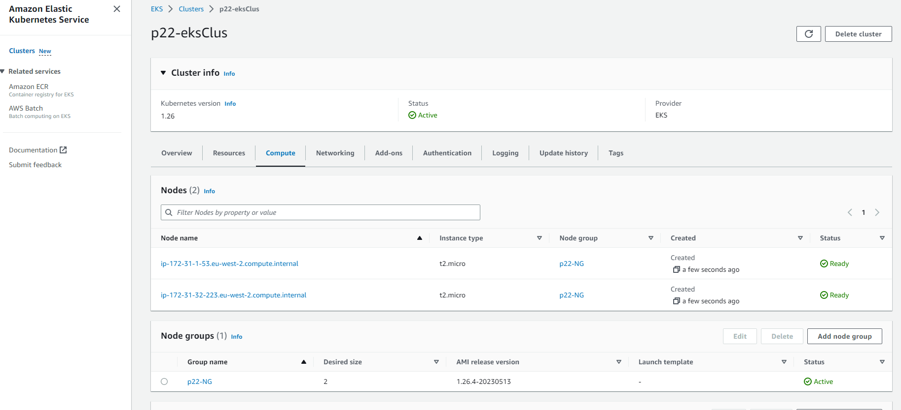

* Updated the `.kube/config` file using and ran `kubectl get svc` as below: 

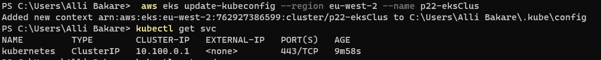

* Confirmed the nodes created

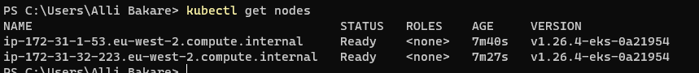

* Instances created by the nodes

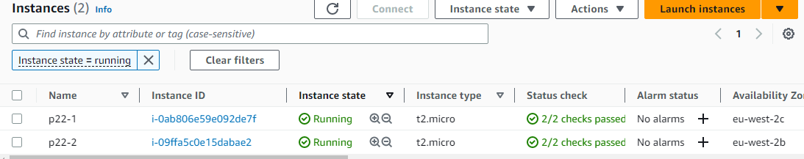


## Step 2: Creating A Pod For The Nginx Application

Create nginx pod using `nginx-pod.yaml` manifest file created with the code shown below:

```
apiVersion: v1
kind: Pod
metadata:
  name: nginx-pod
  labels:
    app: nginx-pod
spec:
  containers:
    - image: nginx:latest
      name: nginx-pod
      ports:
        - containerPort: 80
          protocol: TCP
```

Run: `kubectl apply -f nginx-pod.yaml` to create the nginx pod, and then the following to validate what was created:

`kubectl get pods`

`kubectl describe pod nginx-pod` or `kubectl get pod nginx-pod -o yaml`

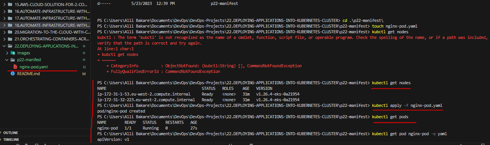


## Step 3: Accessing the App from the browser

Now that I have a running Pod. What’s next?

The ultimate goal of any solution is to access it either through a web portal or some application (e.g., mobile app). We have a Pod with `Nginx container`, so we need to access it from the browser. But all I have is a running Pod that has its own IP address which cannot be accessed through the browser.

To achieve this, I would need another Kubernetes object called `Service` to accept the request and pass it on to the Pod.

A service is an object that accepts requests on behalf of the Pods and forwards it to the Pod’s IP address. If the command below is ran, I will be able to see the `Pod’s IP address`. But there is no way to reach it directly from the outside world.

`kubectl get pod nginx-pod  -o wide` 

Create nginx-service using `nginx-service.yaml` manifest file created with the code shown below:

```
apiVersion: v1
kind: Service
metadata:
  name: nginx-service
spec:
  selector:
    app: nginx-pod
  ports:
    - protocol: TCP
      port: 80
      targetPort: 80
```
Run: `kubectl apply -f nginx-service.yaml` to create the service and then,

`kubectl get service` to confirm the services running:


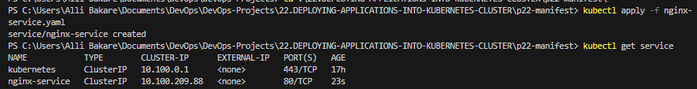


Now that I have a service created and running, how can we access the app? Since there is no public IP address, we can leverage `kubectl's port-forward` functionality.

`kubectl  port-forward svc/nginx-service 8089:80`

`8089` is an arbitrary port number on our laptop or client PC, and we want to tunnel traffic through it to the port number of the `nginx-service` 80.


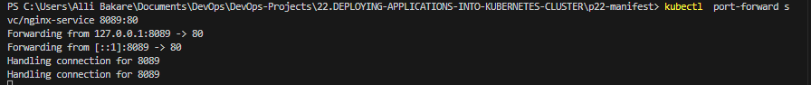


* From the browser:


* Updated the `ngin-service.yaml` file to declare a static port to reach the application using `type: NodePort`:

The `Nginx app` acn then be accessed on the browser using the `NodePort` which exposes the service on the decalred static port on the node’s IP address. The nodeports ranges between `30000-32767` by default.

```
apiVersion: v1
kind: Service
metadata:
  name: nginx-service
spec:
  type: NodePort
  selector:
    app: nginx-pod
  ports:
    - protocol: TCP
      port: 80
      nodePort: 30080
```

`kubectl get service`

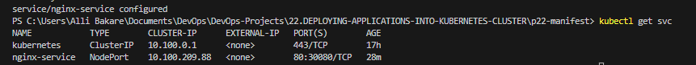

* From the browser:

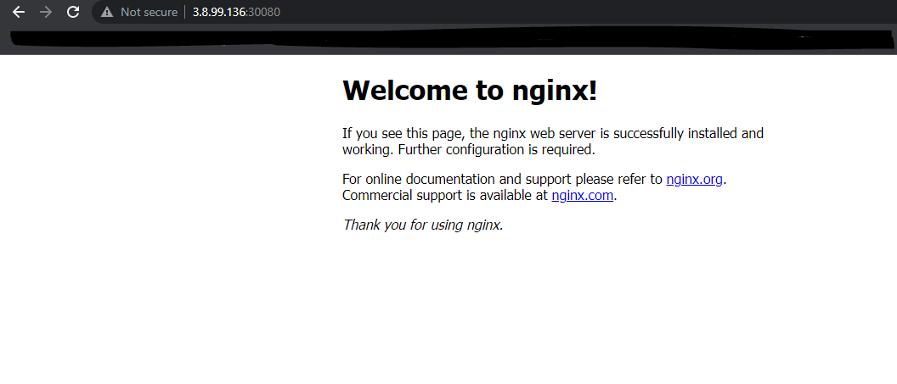


## Step 4: Creating A Replica Set

The `ReplicaSet` object is used to maintain a stable set of Pod replicas running at any given time to achieve availability in case one or two pods dies which can happen anytime

Start by deleting the nginx-pod: `kubectl delete pod nginx-pod`

Then, create the `ReplicaSet` manifest file with the code below and apply it using `kubectl apply -f rs.yaml`

```
apiVersion: apps/v1
kind: ReplicaSet
metadata:
  name: nginx-rs
  labels:
    app: nginx-pod
spec:
  replicas: 2
  selector:
    matchLabels:
      app: nginx-pod
  template:
    metadata:
      name: nginx-pod
      labels:
        app: nginx-pod
    spec:
      containers:
        - name: nginx-pod
          image: nginx:latest
          ports:
            - containerPort: 80
              protocol: TCP
```

* Check the set up with commands below:

`kubectl get rs`

`kubectl get pods`

`kubectl get rs -o wide`


Going ahead to scale `ReplicaSet` up and down:

There are two ways pods can be scaled which are `Imperative` and `Declarative`

Imperative i.e running: `kubectl scale rs ReplicaSetName --replicas=desiredNumber`

And Declarative method is achieved by editing the `rs.yaml` file and changing to the desired number of replicas and applying the update.

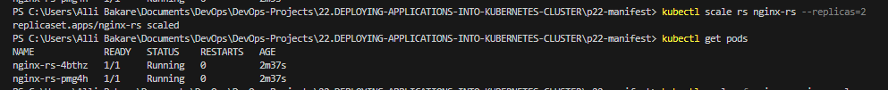

## USING AWS LOAD BALANCER TO ACCESS YOUR SERVICE IN KUBERNETES.

***Note***: I will only be able to test this using **AWS EKS** in this current project. In the next project, I would update my `Terraform code` to build an **EKS cluster**.

I have previously accessed the `Nginx service` through `ClusterIP`, and `NodeIP`, but there is another service type – `Loadbalancer`. This type of service does not only create a service object in K8s, but also provisions a real external Load Balancer (e.g. Elastic Load Balancer – ELB in AWS)

To get the experience of this service type, I'll update the service manifest yaml file as below and use the `LoadBalancer type`, ensuring that the selector references the `Pods` in the `replica set`.


```
apiVersion: v1
kind: Service
metadata:
  name: nginx-service
spec:
  type: LoadBalancer
  selector:
    app: nginx-pod
  ports:
    - protocol: TCP
      port: 80 # This is the port the Loadbalancer is listening at
      targetPort: 80 # This is the port the container is listening at
```

Apply the configuration:

`kubectl apply -f nginx-service.yaml`

`kubectl get svc`

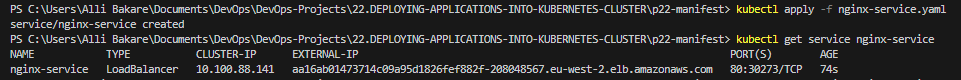

***ELB created in AWS***


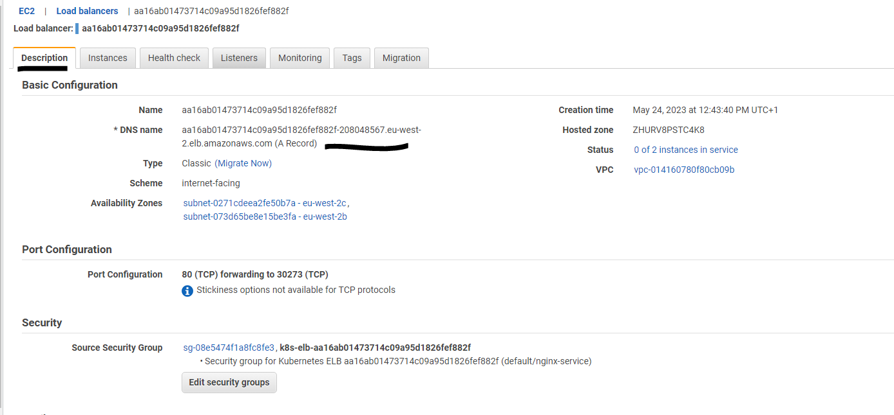

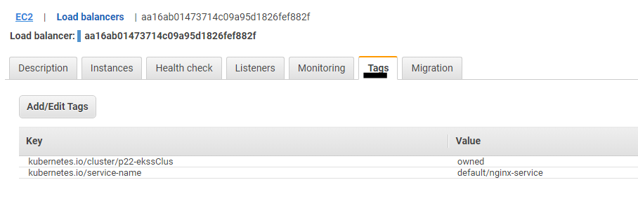

***Note***: A Kubernetes component in the control plane called `Cloud-controller-manager` is responsible for triggering this action. It connects to the specific cloud provider’s APIs (in this case AWS) and create resources such as Load balancers.

Output for running `kubectl get service nginx-service -o yaml` is as seen below showing the dns:

```
apiVersion: v1
kind: Service
metadata:
  annotations:
    kubectl.kubernetes.io/last-applied-configuration: |
      {"apiVersion":"v1","kind":"Service","metadata":{"annotations":{},"name":"nginx-service","namespace":"default"},"spec":{"ports":[{"port":80,"protocol":"TCP","targetPort":80}],"selector":{"app":"nginx-pod"},"type":"LoadBalancer"}}
  creationTimestamp: "2023-05-24T11:43:39Z"
  finalizers:
  - service.kubernetes.io/load-balancer-cleanup
  name: nginx-service
  namespace: default
  resourceVersion: "5976"
  uid: a16ab014-7371-4c09-a95d-1826fef882fc
spec:
  allocateLoadBalancerNodePorts: true
  clusterIP: 10.100.88.141
  clusterIPs:
  - 10.100.88.141
  externalTrafficPolicy: Cluster
  internalTrafficPolicy: Cluster
  ipFamilies:
  - IPv4
  ipFamilyPolicy: SingleStack
  ports:
  - nodePort: 30273
    port: 80
    protocol: TCP
    targetPort: 80
  selector:
    app: nginx-pod
  sessionAffinity: None
  type: LoadBalancer
status:
  loadBalancer:
    ingress:
    - hostname: aa16ab01473714c09a95d1826fef882f-208048567.eu-west-2.elb.amazonaws.com
```

***Note that***

1. A `clusterIP` key is updated in the manifest and assigned an `IP address`. Though I have specified a `Loadbalancer` service type, internally it still requires a `clusterIP` to route the external traffic through.

2. In the ports section, `nodePort` is still used. This is because Kubernetes still needs to use a dedicated port on the `worker node` to route the traffic through. Ensure that port range 30000-32767 is opened in the inbound `security group` configuration.


To access the `Nginx service`, Copy and paste the `load balancer’s dns` to the browser.

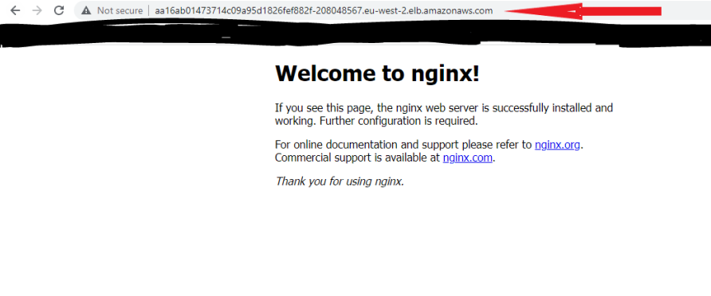


## Step 5: Creating Deployment

A `Deployment` is another layer above `ReplicaSets` and `Pods`. It manages the deployment of ReplicaSets and allows for easy updating of a ReplicaSet as well as the ability to roll back to a previous version of deployment. It is declarative and can be used for rolling updates of micro-services, ensuring there is no downtime.

It is highly recommended to use `Deplyments` to manage replica sets rather than using replica sets directly.

Get started by deleting the ReplicaSet: `kubectl delete rs nginx-rs`

Then, run `kubectl apply -f deployment.yaml` to create a Deployment from a `deployment.yaml` manifest file that is populated with the code below:

```
apiVersion: apps/v1
kind: Deployment
metadata:
  name: nginx-deployment
  labels:
    tier: frontend
    app: nginx-pod
spec:
  replicas: 3
  selector:
    matchLabels:
      tier: frontend
      app: nginx-pod
  template:
    metadata:
      name: nginx-pod
      labels:
        tier: frontend
        app: nginx-pod
    spec:
      containers:
      - name: nginx
        image: nginx:latest
        ports:
        - containerPort: 80
```

* Check the set up with commands below:

`kubectl get deploy`

`kubectl get rs`

`kubectl get pods`

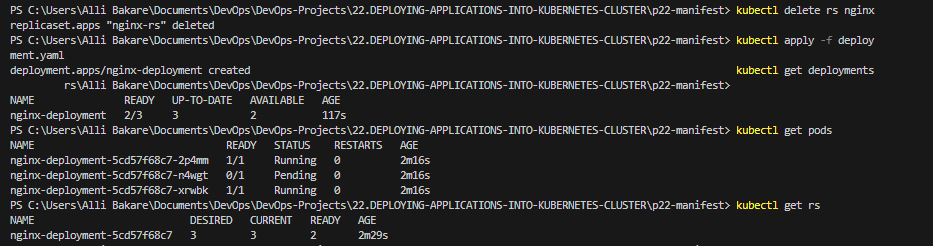

* Exec into one of the Pod’s container to run Linux commands

`kubectl exec -it nginx-deployment-5cd57f68c7-2p4mm bash`

* List the files and folders in the Nginx directory

`ls -ltr /etc/nginx/`

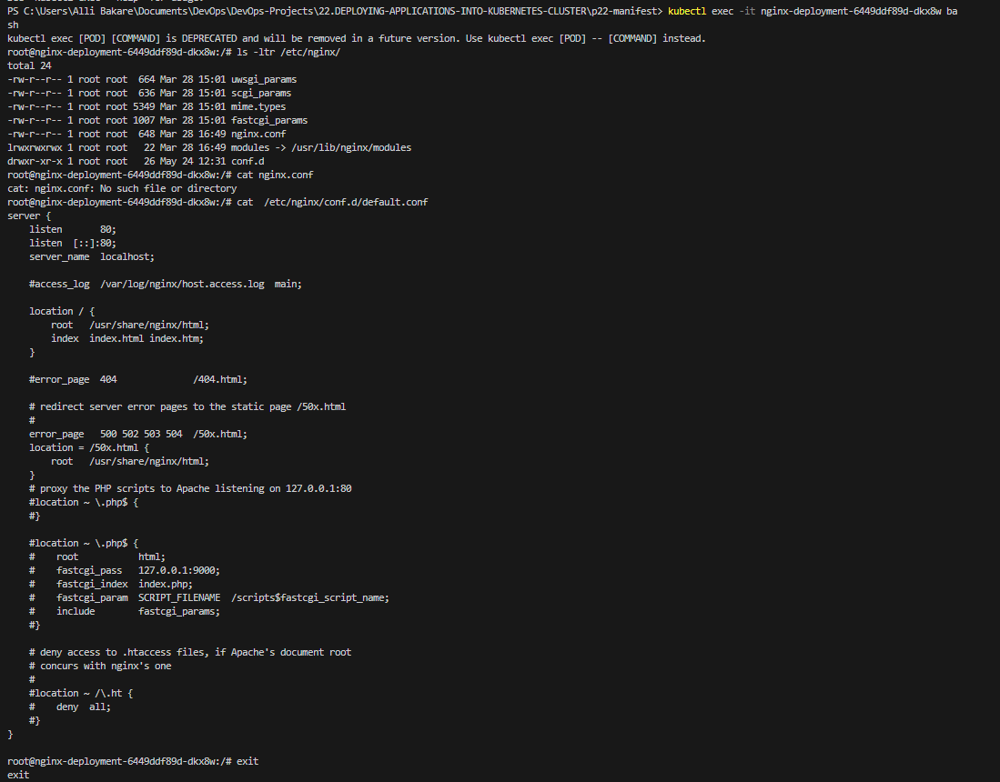

## PERSISTING DATA FOR PODS

Deployments are stateless by design. Hence, any data stored inside the Pod’s container does not persist when the Pod dies.

If you were to update the content of the `index.html` file inside the container, and the Pod dies, that content should not be lost since a new Pod will replace the dead one.

Let us try that:

* Scale the Pods down to 1 replica, run: `kubectl scale deploy nginx-deployment --replicas=1`

* Exec into the running container, run: `kubectl exec -it nginx-deployment-5cd57f68c7-2p4mm bash`

* Install `vim` so that I can edit the file

```
apt-get update
apt-get install vim
```
* Update the content of the `index.html` file and add the code below: `/usr/share/nginx/html/index.html`

```
<!DOCTYPE html>
<html>
<head>
<title>Welcome to DAREY.IO!</title>
<style>
    body {
        width: 35em;
        margin: 0 auto;
        font-family: Tahoma, Verdana, Arial, sans-serif;
    }
</style>
</head>
<body>
<h1>Welcome to DAREY.IO!</h1>
<p>I love experiencing Kubernetes</p>

<p>Learning by doing is absolutely the best strategy at 
<a href="https://darey.io/">www.darey.io</a>.<br/>
for skills acquisition
<a href="https://darey.io/">www.darey.io</a>.</p>

<p><em>Thank you for learning from DAREY.IO</em></p>

<p><em>Thank you for using nginx</em></p>
</body>
</html>
```

* Check the browser – Got this!!!

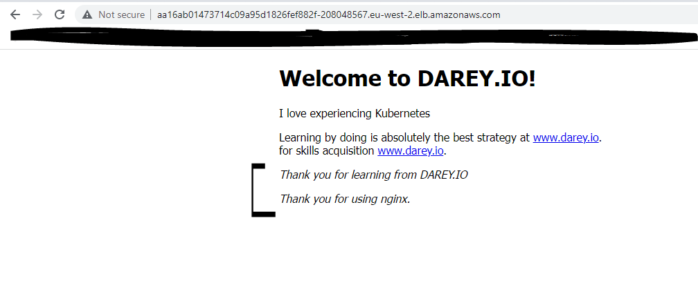

* Now, delete the only running Pod

`kubectl delete po nginx-deployment-5cd57f68c7-2p4mm`

***We got back to the usual nginx page as a new pod was immediately created***

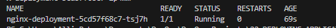


***..........END OF PROJECT..............***


